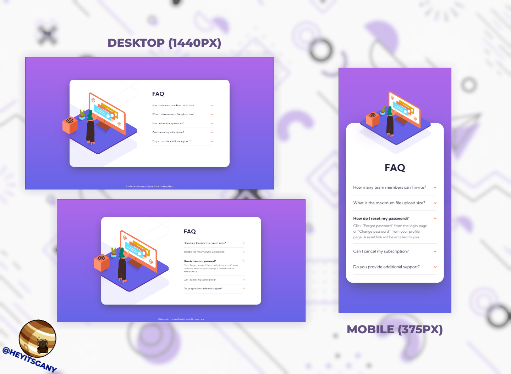

# Frontend Mentor - FAQ accordion card solution

This is a solution to the [FAQ accordion card challenge on Frontend Mentor](https://www.frontendmentor.io/challenges/faq-accordion-card-XlyjD0Oam). Frontend Mentor challenges help you improve your coding skills by building realistic projects.

## Table of contents

- [Overview](#overview)
  - [The challenge](#the-challenge)
  - [Screenshot](#screenshot)
  - [Links](#links)
- [My process](#my-process)
  - [What I learned](#what-i-learned)
- [Author](#author)

## Overview

### The challenge

The challenge is to build out this FAQ accordion card and get it looking as close to the design as possible.

Users should be able to:

- View the optimal layout for the component depending on their device's screen size
- See hover states for all interactive elements on the page
- Hide/Show the answer to a question when the question is clicked

### Screenshot

### Links

- Live Site URL: [https://heyitsgany.github.io/faq-accordion-card](https://heyitsgany.github.io/faq-accordion-card)

## My process

### What I learned

This was a fairly straight-forward design to implement. The JavaScript is very simple, I wanted to avoid adding an event listener to each button in a for loop as it isn't very performant. I instead opted to add an event listener to the FAQ div and simply check the class list of the element clicked. If the element is a question, then we reveal the relevant answer. The JavaScript also handles closing an answer when another is clicked, so only one answer will be displayed at a time. This small script was good practice of my knowledge of vanilla JavaScript.

I strengthend my understanding of absolute positioning and making use of the overflow property. I also worked using a mobile first workflow, which made the design process a little quicker as the desktop design had a more complex design.

Use this section to recap over some of your major learnings while working through this project. Writing these out and providing code samples of areas you want to highlight is a great way to reinforce your own knowledge.

## Author

- Frontend Mentor - [@heyitsgany](https://www.frontendmentor.io/profile/heyitsgany)
- Twitter - [@heyitsgany](https://www.twitter.com/heyitsgany)
